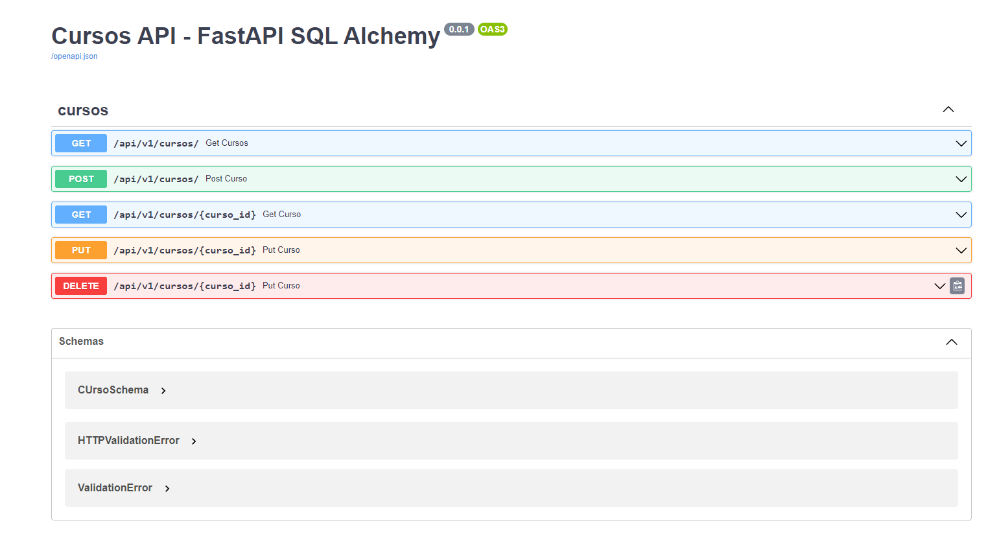

# FastAPI + PostgreSQL

### Modelagem e estruturação da api para deixa-la organizada para futuras atualizações

**INSTALE O POSTGRESQL E CRIE UM BANCO DE DADOS `POSTGRESQL` COM O NOME `faculdade`, E APÓS ISSO INSTALE AS BIBLIOTECAS**

```api
pip install -r requirements.txt
```

**APÓS INSTALAR AS BIBLIOTECAS, EXECUTE A APLICAÇÃO**

```api
python main.py
```

### VOCÊ PODE VER A DOCUMENTAÇÃO NO LINK ABAIXO, USANDO O MODELO `SWAGGER`:

```api
http://localhost:8000/docs
```



#

## E ABAIXO SÃO AS ROTA PRINCIPAIS DA APLICAÇÃO

*`POST cursos`: Cadastrar cursos*
```api
http://localhost:8000/api/v1/curso/
```

*`GET cursos`: Todos os cursos*
```api
http://localhost:8000/api/v1/cursos/
```

*`GET curso`: Buscar por um curso*
```api
http://localhost:8000/api/v1/curso/1/
```

*`PUT curso`: Atualizar um curso*
```api
http://localhost:8000/api/v1/curso/1/
```

*`DELETE curso`: Deletear um curso*
```api
http://localhost:8000/api/v1/curso/1/
```


